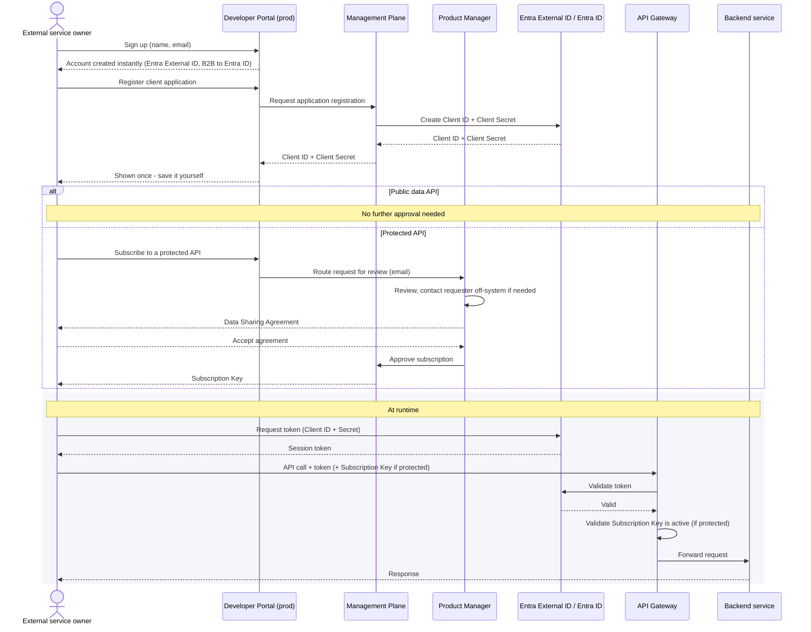

# Consumer: Production access

Covers both public-data and protected APIs — they share the same sign-up and application
registration steps, and diverge only at the point of subscribing to a specific API.

