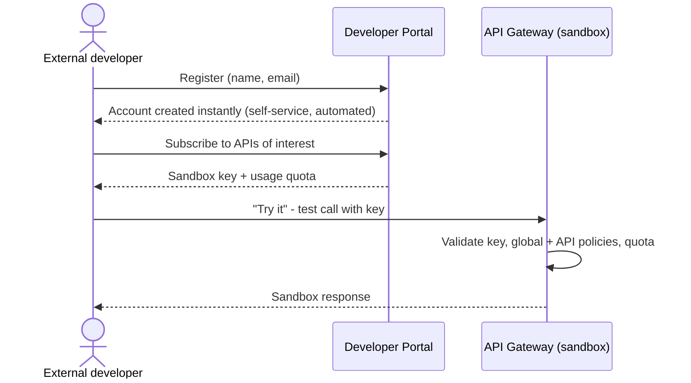

# Consumer: Try it now (sandbox)

```mermaid
sequenceDiagram
    actor Dev as External developer
    participant Portal as Developer Portal
    participant Gateway as API Gateway (sandbox)

    Dev->>Portal: Register (name, email)
    Portal-->>Dev: Account created instantly (self-service, automated)
    Dev->>Portal: Subscribe to APIs of interest
    Portal-->>Dev: Sandbox key + usage quota
    Dev->>Gateway: "Try it" - test call with key
    Gateway->>Gateway: Validate key, global + API policies, quota
    Gateway-->>Dev: Sandbox response
```
