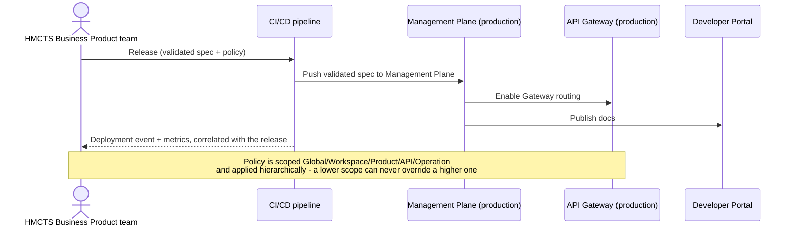

# Producer: Production deployment

Covers the core release path. Three related concerns build on this same flow rather than
each getting their own diagram:

- **Policy deployment** — policy is a separate artefact from the API spec, scoped
  Global / Workspace / Product / API / Operation and applied hierarchically. A lower scope
  can never silently override a higher one.
- **Cross-domain CI/CD (Crime → CCNP)** — Crime teams publish a versioned release bundle
  (OpenAPI contract + policy + APIM config + environment parameters) to an artefact
  repository instead of running this pipeline directly; a separate CCNP-owned pipeline
  picks it up, runs its own governance and security validation, and deploys. No Crime
  developer ever gets interactive access to the CCNP subscription.
- **Deprecation management** — an ongoing production-lifecycle activity once an API is
  live: publishing a new version flags the prior one deprecated, the Gateway watches for
  the deprecation indicator on every response, and analytics correlates deprecated calls
  back to the calling subscription for reporting.

