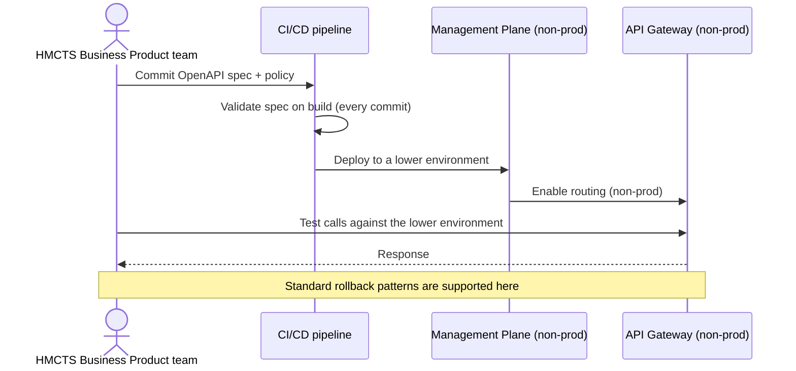

# Producer: Try it now (validate in a lower environment)

```mermaid
sequenceDiagram
    actor Producer as HMCTS Business Product team
    participant CI as CI/CD pipeline
    participant Mgmt as Management Plane (non-prod)
    participant Gateway as API Gateway (non-prod)

    Producer->>CI: Commit OpenAPI spec + policy
    CI->>CI: Validate spec on build (every commit)
    CI->>Mgmt: Deploy to a lower environment
    Mgmt->>Gateway: Enable routing (non-prod)
    Producer->>Gateway: Test calls against the lower environment
    Gateway-->>Producer: Response
    Note over Producer,Gateway: Standard rollback patterns are supported here
```
